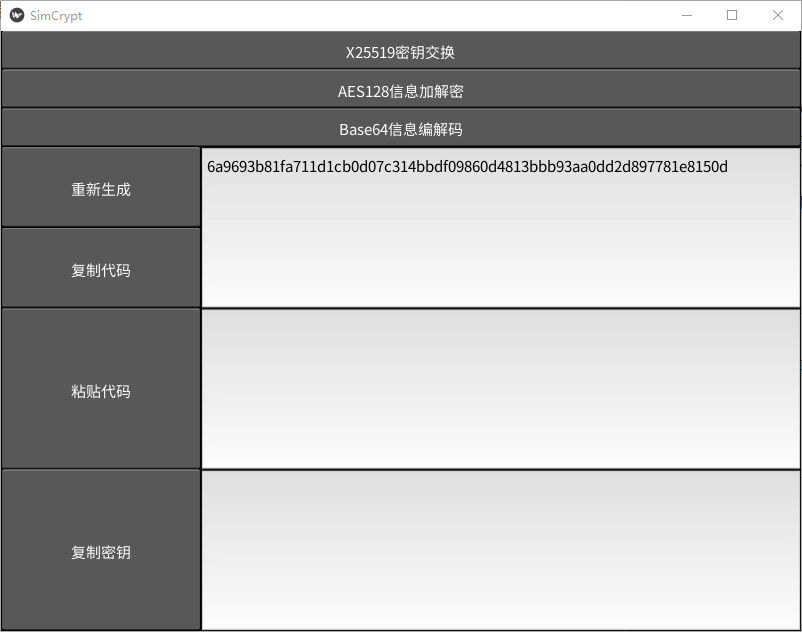

# SimCrypt
顾名思义，一个简单的加密工具。
使用kivy编写，为了能在Android上运行。
主要供日常使用，可以避免一些词汇被和谐的麻烦（虽然丢进去加密一下可能更麻烦……）。
## 编译
目前只编译了Windows版（PyInstaller打包）和Android版（Buildozer打包），因为我日常只用Windows和Android。
理论上也可以在macOS，IOS，Linux上运行，但是我没有试过。
有需要的朋友可以自己捣鼓一下。~~相信我，编译打包过程**非常简单**。~~
不过记得发布的时候遵守一下GPL协议哦。
## 使用
GUI你都不会用吗？
正确的使用姿势应该是在国内平台谈论“那些话题”的时候，把文本先丢到这里加密（或者简单的base64编码）一下再发送，避免“丢包”。
## 截图

